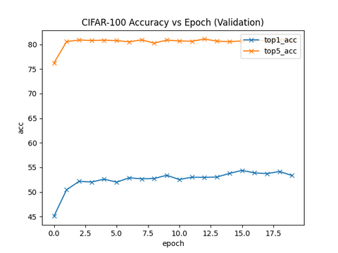

# Open world perception

## Code structure

All of our code can be found under the `notebooks` folder in our repository.

## Commands to Reproduce Experiments

In order to run the notebooks we recommend the usage of Google Colab notebooks.

## Task

The task that we are studying is using different methods of contrastive learning to do image classification.

## Datasets

We evaluate our approach on 3 publically avaliable datasets.

#### CIFAR-10

This dataset contains 60k color images which are uniformly distributed accross 10 classes. The images are of size 4x32x32.
- Alex Krizhevsky. [Learning Multiple Layers of Features from Tiny Images](https://www.cs.toronto.edu/~kriz/learning-features-2009-TR.pdf), 2009.

#### STL-10

This dataset contains 500 training images as well as one thousand testing images per class. Additionally, the dataset also contains 100k unlabeled images, which do not use for training, thus our model doesn't have state of the art performance.

- Adam Coates, Honglak Lee, Andrew Y. Ng. [An Analysis of Single Layer Networks in Unsupervised Feature Learning AISTATS](https://cs.stanford.edu/~acoates/papers/coatesleeng_aistats_2011.pdf), 2011

#### Caltech-101

This dataset consists of colour images of objects belonging to 101 classes.
- Fei-Fei, Li, Rob Fergus, and Pietro Perona. "[One-shot learning of object categories.](http://vision.stanford.edu/documents/Fei-FeiFergusPerona2006.pdf)" IEEE transactions on pattern analysis and machine intelligence 28.4 (2006): 594-611.

## Experiments

The topics relating to optimizers address different concerns and the hyperparameters of each approach are vastly different. Therefore, we have experiments for each idea and then some comparisons at the end.

# MoCo
We fine-tuned a pre-trained MoCo model on the three image classifiation dataset and compare it to a ResNet-50 model, randomly initialized and fine-tuned with the same data. The code is located in `notebooks/moco.ipynb`.

We downloaded the pre-trained MoCo model from [the MoCo github](https://github.com/facebookresearch/moco). The weights are for a ResNet-50, which We added a linear layer with the corresponding classes size for each dataset to. According to the MoCo paper they trained for 200 epochs over the [ImageNet-1M](https://www.image-net.org) and [Instagram-1B](https://paperswithcode.com/dataset/ig-1b-targeted), which took ~6 days. As comparison, We also implemented a ResNet-50 with the same layers, but randomly initialized.

Both models were trained using Adam optimizer, a learning rate of .0001, and cross entropy loss.

## CIFAR-10

## Caltech-101

## STL-10

## Observations

| Datasets/Model | MoCo | ResNet-50 |
|---|---|---|
| CIFAR-10 | 87.42 | 73.72 |
| Caltech-101 | 25.08 | 18.05 |
| STL10 | 54.45 | 23.28 |

MoCo greatly outperforms ResNet-50 on all three datasets. The pre-training done for MoCo Seems not only speed up convergence but also increase classification accuracy. This is most likely because it creates important pathways during the unsupervised training tasks that are not replicable through supervised training.

For CIFAR-10 MoCo converges much faster and reaches a training accuracy of 87.42% compared to the randomly initialized ResNet-50 when was only able to obtain an accuracy of 73.72%.

While neither model preformed significantly well on the Caltech-101 dataset, MoCo was able to learn better on the small training set then ResNet-50. These models most likely did not perform well due to the limited size of the dataset.

Training on the STL-10 dataset produced similar results to training on the Caltech dataset. There is a clear difference between the two models with MoCo performing better both accuracy and convergence rate wise. The limited size of the dataset is also the most likely culprit as to why the accuracies are so low.

Using transfer learning increases the convergence rate and accuracy. This method does seem to require large amounts of compute resources since MoCo took ~6 days to pre-train on 64 GPUs, however when trained it has relatively fast fine-tuning time.

# SimCLR
We fine-tuned a pre-trained SimCLR (v1) model on the three image classifiation dataset. The results can be replicated by running `python simclr.py -d DATASET`.

We downloaded the pre-trained SimCLR 1x model checkpoints from [the SimCLR github](https://github.com/google-research/simclr) and converted them to pytorch using the following [SimCLR pytorch converter](https://github.com/tonylins/simclr-converter). Finally we add a randomly initialized linear layer with output dimension equal to the class size for each dataset.

All models were trained using cross-entropy loss and Adam optimizer with a learning rate of 1e-3.

## CIFAR-10

 

## Caltech-101

 

## STL-10

 

# VirTex

# ConVIRT

# Comparison

### Accuracy comparsion of contrastive learning models between datasets (trained till 20 epochs)

| Datasets/Model | MoCo | SimCLR | VirTex | ConVIRT |
|---|---|---|---|---|
| CIFAR-10 | 87.42 | 82.26 |  |   |
| Caltech-101 | 25.08 | 54.40  |  |  |
| STL10 | 54.45 | 85.81 |  |  |

# References

[MoCo pretrained weights](https://github.com/facebookresearch/moco)

[MoCo weights loading example](https://discuss.pytorch.org/t/how-to-load-moco-model-weights-that-are-stored-as-an-state-dict/111549/4)

[SimCLR pretrained weights](https://github.com/google-research/simclr)

[SimCLR pytorch converter](https://github.com/tonylins/simclr-converter)

