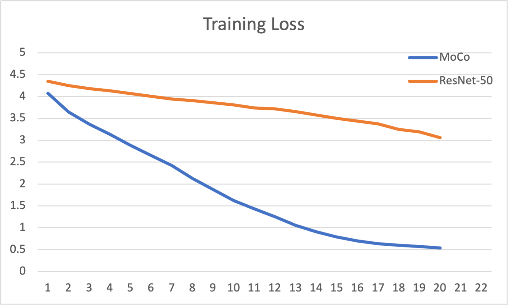

# Open world perception

## Code structure

All of our code can be found under the `notebooks` folder in our repository. 

## Commands to Reproduce Experiments

In order to run the notebooks we recommend the usage of Google Colab notebooks. 

## Task

The task that we are studying is using different methods of contrastive learning to do image classification.

## Datasets

We evaluate our approach on 3 publically avaliable datasets. 

#### CIFAR-10

This dataset contains 60k color images which are uniformly distributed accross 10 classes. The images are of size 4x32x32. 
- Alex Krizhevsky. [Learning Multiple Layers of Features from Tiny Images](https://www.cs.toronto.edu/~kriz/learning-features-2009-TR.pdf), 2009.

#### STL-10

This dataset contains 500 training images as well as one thousand testing images per class. Additionally, the dataset also contains 100k unlabeled images, which do not use for training, thus our model doesn't have state of the art performance.

- Adam Coates, Honglak Lee, Andrew Y. Ng. [An Analysis of Single Layer Networks in Unsupervised Feature Learning AISTATS](https://cs.stanford.edu/~acoates/papers/coatesleeng_aistats_2011.pdf), 2011

#### Caltech-101

This dataset consists of colour images of objects belonging to 101 classes. 
- Fei-Fei, Li, Rob Fergus, and Pietro Perona. "[One-shot learning of object categories.](http://vision.stanford.edu/documents/Fei-FeiFergusPerona2006.pdf)" IEEE transactions on pattern analysis and machine intelligence 28.4 (2006): 594-611.

## Experiments

The topics relating to optimizers address different concerns and the hyperparameters of each approach are vastly different. Therefore, we have experiments for each idea and then some comparisons at the end.

# MoCo

## CIFAR-10

## Caltech-101

## STL-10

## Observations

# SimCLR

# VirTex

# ConVIRT

# Comparison

### Accuracy comparsion of contrastive learning models between datasets (trained till 20 epochs) 

| Datasets/Model | MoCo | SimCLR | VirTex | ConVIRT |
|---|---|---|---|---|
| Cifar-10 |  |  |  |   | 
| Caltech-101 |  |  |  |  | 
| STL10 |  |  |  |  |  

# References

[MoCo pretrained weights](https://github.com/facebookresearch/moco)

[MoCo weights loading example](https://discuss.pytorch.org/t/how-to-load-moco-model-weights-that-are-stored-as-an-state-dict/111549/4)

